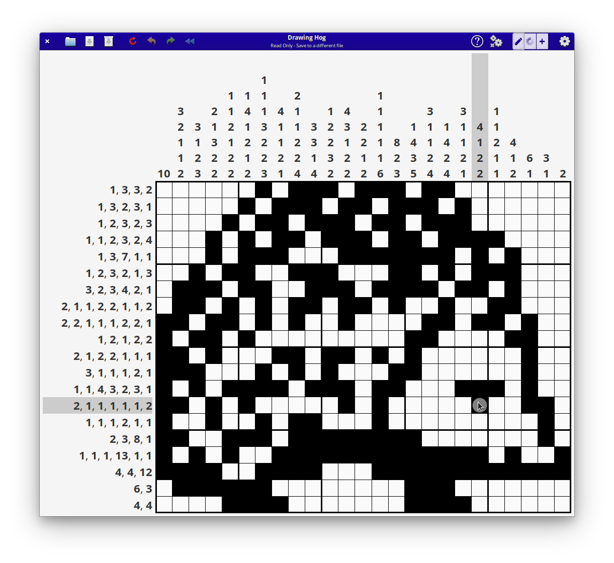

#  gnonogram-tools
Tools for creating gnonogram games, written in Vala/Gtk and intended primarily for elementaryos.

[](http://www.gnu.org/licenses/gpl-3.0)



### Dependencies
These dependencies must be present before building
 - `valac`
 - `meson`
 - `gtk+-3.0`
 - `granite`

 You can install these on a Ubuntu-based system by executing this command:

 `sudo apt install valac meson libgranite-dev`

### Building
```
meson build --prefix=/usr  --buildtype=release
cd build
ninja
```

### Installing & executing
```
sudo ninja install
com.github.jeremypw.gnonogram-tools
```

### Uninstalling
```
In original build directory:

sudo ninja uninstall
sudo ./post_uninstall.py
```
